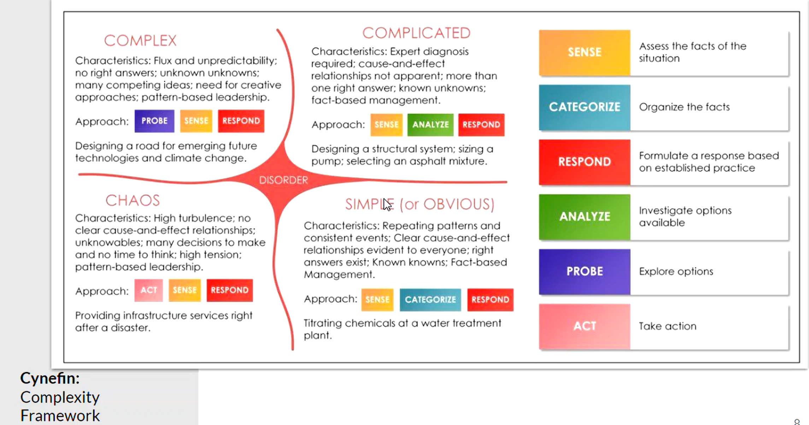

# Agile vs Traditional

Traditional
: Having the entire plan laid out from start to finish for a project or program

Agile
: Smaller projects or functional modules (minimal viable project) to concentrate on rather than the project as a whole

Project
: Has a start and an end for a product

Repriortisation
: finding the procedures that are the most important at the current moment

| Traditional                             |                       Agile                       |
| :-------------------------------------- | :-----------------------------------------------: |
| Complete Solutions                      |                Functional Modules                 |
| Linear Development                      |                 Short Iterations                  |
| Lock Down Change                        | Experimentation, Improvement and repriortisation  |
| Users specify all requirements to start |       Users embedded throughout the process       |

## Stacy Matrix

Horizontal axis is high acceptance closer to the axis

Vertical is high certainty to low acceptance

Quadrants of characteristics and the management style it takes

agile vs waterfall

is this changing the overall file?
